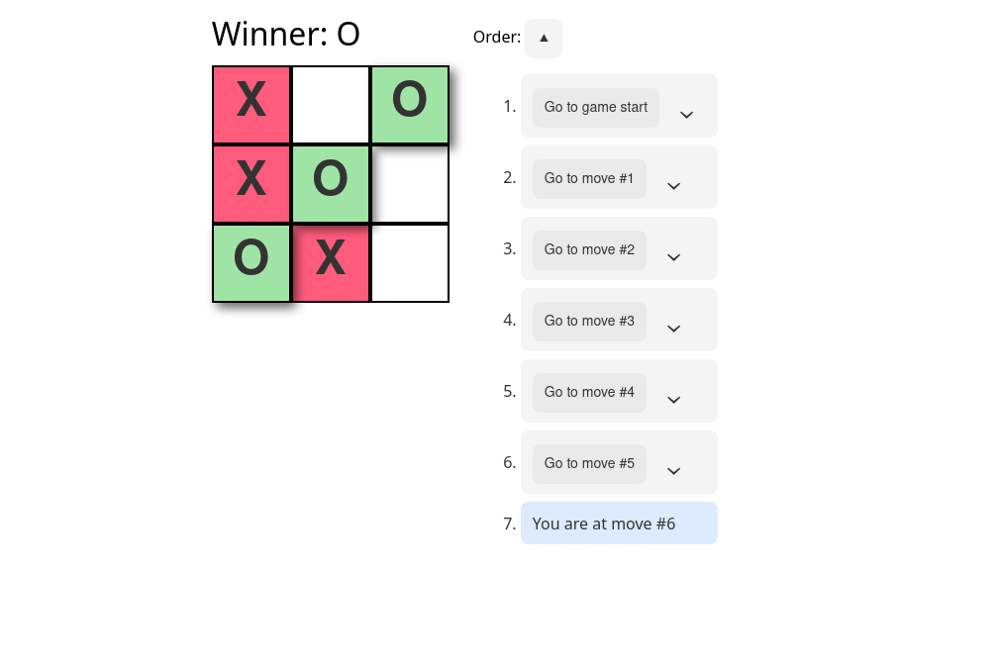

#  Tic-tac-toe Game

---

<p align="center">
   
</p>

<p align="center">
<a href='https://giuxtaposition.github.io/tic-tac-toe/'>Go check it out 🎉</a>
</p>

---

# 📌 Table of Contents

- [ Tic-tac-toe Game](#-tic-tac-toe-game)
- [📌 Table of Contents](#-table-of-contents)
  - [👩‍💻 Project Description](#-project-description)
  - [🎉 Features](#-features)
  - [👷 Running Locally](#-running-locally)
  - [🔧 Built with](#-built-with)
  - [🧪 Testing with](#-testing-with)

## 👩‍💻 Project Description

This is the classic tic-tac-toe game we used to play when we were kids made in `React`.
In this project I tried to "think in react" and follow its best practices.

## 🎉 Features

- Play the game taking turns. (First X, then O) until Win or Draw.
- Keep history of player moves.
- Go back to specific move and keep playing from there.

## 👷 Running Locally

``` bash
git clone https://github.com/giuxtaposition/tic-tac-toe.git
cd tic-tac-toe
yarn install
yarn start
```

## 🔧 Built with

- React.js
- Typescript

## 🧪 Testing with

- Jest
- React Testing Library
